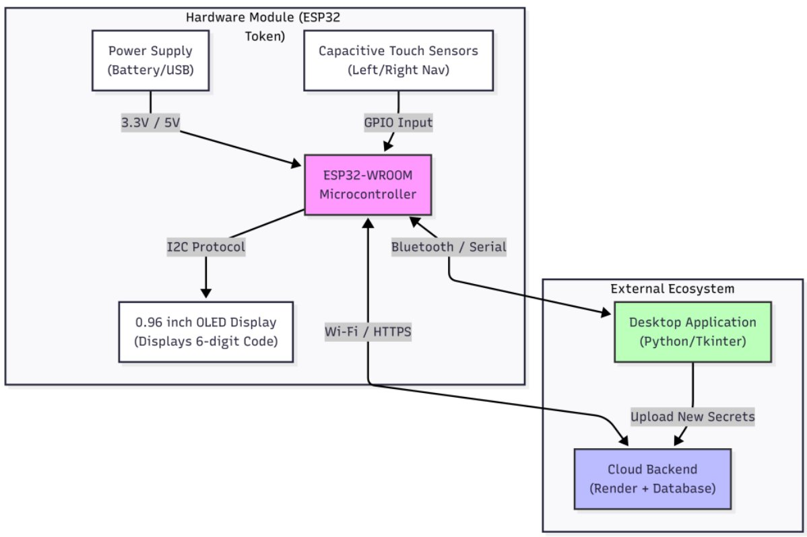
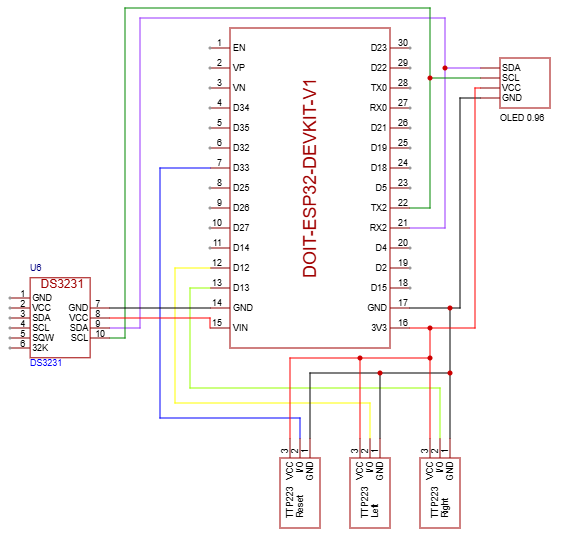

# 🔐 ESP32 Cloud-Synced Hardware 2FA Token

A production-grade, cloud-synced hardware two-factor authentication (2FA) token built with an ESP32 microcontroller, a Python desktop app, and a Vercel + Supabase backend. Scan QR codes from any service, store them securely in the cloud, and display live TOTP codes on a physical OLED display — no phone required.

---

## 📐 System Architecture



The system is split into two ecosystems:

- **Hardware Module** — ESP32-WROOM reads touch inputs, drives the OLED over I2C, syncs time via RTC, and communicates with the cloud over WiFi/HTTPS. It is configured from the desktop app over USB Serial.
- **External Ecosystem** — The Python desktop app handles QR scanning, account management, and device setup. It communicates with the cloud backend (Vercel + Supabase) to store and retrieve TOTP secrets.

---

## 🔌 Circuit Schematic



---

## 🧰 Hardware Required

| Component | Details |
|---|---|
| ESP32-WROOM-32 | Main microcontroller |
| 0.96" OLED Display | SH1106 driver (128×64, I2C) |
| TTP223 Touch Sensors | ×3 — Next, Prev, Sync |
| DS3231 RTC Module | Real-time clock with battery backup |
| CR2032 Battery | For RTC backup |
| USB Cable | For programming and setup |
| Jumper Wires | For connections |

---

## 🔌 Wiring Reference

### OLED Display (SH1106, I2C)
| OLED Pin | ESP32 Pin |
|---|---|
| VCC | 3.3V |
| GND | GND |
| SCL | GPIO 22 |
| SDA | GPIO 21 |

### DS3231 RTC Module
| RTC Pin | ESP32 Pin |
|---|---|
| VCC | VIN (5V) ⚠️ Must be 5V, not 3.3V |
| GND | GND |
| SCL | GPIO 22 (shared with OLED) |
| SDA | GPIO 21 (shared with OLED) |

### TTP223 Touch Sensors
| Sensor | ESP32 Pin | Function |
|---|---|---|
| Touch 1 | GPIO 13 | Next account |
| Touch 2 | GPIO 12 | Previous account |
| Touch 3 | GPIO 33 | Manual cloud sync |
| All VCC | 3.3V | Power |
| All GND | GND | Ground |

---

## 🖥️ Software Architecture

### Desktop App (`gui_app.py`)
- Built with Python + Tkinter
- Login/Register screen with JWT authentication
- Live TOTP code display with countdown progress bars
- QR code scanning via webcam or screenshot upload
- USB Serial device configuration — sends WiFi + auth to ESP32 automatically
- Delete accounts from cloud

### Backend (`api/index.py`)
- Flask app deployed on Vercel (serverless)
- Endpoints:
  - `POST /api/register` — create user account
  - `POST /api/login` — authenticate, returns JWT
  - `POST /api/upload` — save a 2FA secret (JWT auth)
  - `GET /api/fetch` — get your secrets (JWT auth)
  - `DELETE /api/delete` — remove a secret (JWT auth)
  - `GET /api/device/token` — get device config for ESP32 setup
  - `GET /api/device/fetch` — fetch secrets for ESP32 (API key auth)

### ESP32 Firmware (`firmware.ino`)
- Receives full configuration from desktop app over USB Serial
- Stores WiFi credentials, user ID, and API key in NVS Flash
- Connects to WiFi, syncs time via NTP, updates RTC
- Fetches TOTP secrets from cloud using device API key
- Generates TOTP codes using HMAC-SHA1
- Caches secrets in flash for offline use

---

## 🚀 Setup Guide

### Step 1 — Supabase Database

1. Create a free account at [supabase.com](https://supabase.com)
2. Create a new project
3. Go to the **SQL Editor** and run:

```sql
-- Users table
CREATE TABLE users (
  id bigint generated by default as identity primary key,
  created_at timestamp with time zone default timezone('utc'::text, now()) not null,
  username text not null unique,
  password_hash text not null
);

-- Secrets table
CREATE TABLE secrets (
  id bigint generated by default as identity primary key,
  created_at timestamp with time zone default timezone('utc'::text, now()) not null,
  issuer text not null,
  name text not null,
  secret text not null unique,
  user_id bigint references users(id)
);
```

4. Go to **Project Settings → API** and copy your Project URL and `anon` public key.

---

### Step 2 — Vercel Backend

1. Install Vercel CLI:
```bash
npm install -g vercel
```

2. Navigate to the backend folder:
```bash
cd esp32-cloud-backend
```

3. Open `api/index.py` and fill in your values:
```python
SUPABASE_URL   = "https://xxxx.supabase.co"
SUPABASE_KEY   = "your-supabase-anon-key"
JWT_SECRET     = "any-long-random-string-you-make-up"
DEVICE_API_KEY = "another-long-random-string-you-make-up"
```

4. Make sure `requirements.txt` contains:
```
flask
supabase
bcrypt
PyJWT
```

5. Deploy:
```bash
vercel --prod
```

6. Go to your Vercel dashboard → Project Settings → **Deployment Protection** → **Disable**

7. Note your deployment URL, e.g. `https://your-project.vercel.app`

---

### Step 3 — Desktop App

1. Install Python dependencies:
```bash
pip install requests pyserial opencv-python pyzbar Pillow
```

2. Open `gui_app.py` and set your Vercel URL:
```python
SERVER_URL = "https://your-project.vercel.app/api"
```

3. Run the app:
```bash
python gui_app.py
```

4. Click **Register** to create your account, then log in.

---

### Step 4 — Arduino IDE Setup

1. Install [Arduino IDE](https://www.arduino.cc/en/software)

2. Add ESP32 board support:
   - Go to **File → Preferences**
   - Add to Additional Board Manager URLs:
     ```
     https://raw.githubusercontent.com/espressif/arduino-esp32/gh-pages/package_esp32_index.json
     ```
   - Go to **Tools → Board → Boards Manager**, search `esp32`, install

3. Install these libraries via **Tools → Manage Libraries**:
   - `Adafruit SH110X`
   - `Adafruit GFX Library`
   - `ArduinoJson`
   - `TOTP library`
   - `Ds3231` by Makuna (search "RtcDS3231")

4. Open `firmware.ino` and set your Vercel URL:
```cpp
const char* serverBaseUrl = "https://your-project.vercel.app";
```

5. Select your board:
   - **Tools → Board → ESP32 Arduino → ESP32 Dev Module**
   - **Tools → Port → COM__ (your ESP32 port)**

6. Upload the firmware (see troubleshooting below if upload fails)

---

### Step 5 — Configure the ESP32

This is fully automatic — no code editing required.

1. Connect ESP32 to your PC via USB
2. Press the **RST** button on the ESP32
3. Open the desktop app and log in
4. Click **📶 Setup Device** in the footer
5. Select the correct COM port
6. Enter your WiFi name and password
7. Click **Configure Device**
8. Wait for "✓ Device configured successfully!"

The app automatically sends your WiFi credentials, user ID, and security key to the ESP32. Everything is saved permanently to flash — no reconfiguration needed on future boots.

---

### Step 6 — Add Your First 2FA Account

1. In the desktop app, click **+ Add Account**
2. Choose **Webcam** or **Upload Screenshot**
3. Scan the QR code from any service (Google, GitHub, Instagram, etc.)
4. The secret is uploaded to the cloud
5. Press the **Sync** touch sensor on your ESP32 to fetch it

---

## 📱 Using the Hardware Token

| Touch Sensor | Action |
|---|---|
| GPIO 13 (Next) | Scroll to next account |
| GPIO 12 (Prev) | Scroll to previous account |
| GPIO 33 (Sync) | Manually sync with cloud |

- **LED blinks** when a code has less than 10 seconds remaining
- **Progress bar** at the bottom of the OLED shows time remaining
- **Offline mode** — cached secrets work without WiFi using RTC time
- **Click a code** in the desktop app to copy it to clipboard instantly

---

## ⚠️ Common Errors & Fixes

### Upload Errors

**`Failed to connect to ESP32: No serial data received`**
> The ESP32 isn't entering bootloader mode automatically.
>
> Fix: Hold the **BOOT** button → click Upload in Arduino IDE → when you see `Connecting......` press and release **RST** → release BOOT once upload percentage starts.
> Also try: Tools → Upload Speed → change to `115200`

**`Serial port in use` or port not appearing**
> Another program is holding the COM port.
>
> Fix: Close the desktop app, close Arduino Serial Monitor, and close any other serial terminal. Only one program can use a COM port at a time.

---

### Backend Errors

**`401 Unauthorized` from Vercel**
> Vercel Deployment Protection is enabled.
>
> Fix: Vercel dashboard → your project → Settings → Deployment Protection → Disable.

**`Could not reach server`**
> Wrong Vercel URL in `gui_app.py`.
>
> Fix: Make sure `SERVER_URL` ends in `/api` with no trailing slash:
> ```python
> SERVER_URL = "https://your-project.vercel.app/api"
> ```

**`Username already exists` on register**
> The username is already taken in Supabase.
>
> Fix: Choose a different username, or go to Supabase → Table Editor → users → delete the row manually.

---

### Display Errors

**Blank OLED screen on boot**
> I2C initialization order conflict.
>
> Fix: Always initialize display before RTC. Order must be `Wire.begin()` → `display.begin()` → `Rtc.Begin()`.

**Static noise / random pixels on OLED**
> Wrong OLED driver. Most cheap 0.96" displays use SH1106, not SSD1306.
>
> Fix: Use `Adafruit_SH1106G` instead of `Adafruit_SSD1306`. Already handled in this firmware.

---

### RTC Errors

**RTC stuck on year 2000**
> DS3231 getting insufficient voltage from 3.3V pin.
>
> Fix: Move RTC VCC wire from 3.3V to **VIN (5V)** on the ESP32.

**Time drifts or TOTP codes are wrong after reboot**
> RTC oscillator flags are set incorrectly.
>
> Fix: Upload this snippet once to clear the flags:
> ```cpp
> Rtc.SetIsWriteProtected(false);
> Rtc.SetIsRunning(true);
> Rtc.Enable32kHzPin(false);
> Rtc.SetSquareWavePin(DS3231SquareWavePin_ModeNone);
> ```

---

### Device Setup Errors

**`Could not load account config. Please restart the app.`**
> The desktop app failed to fetch device credentials from the server after login.
>
> Fix: Make sure your Vercel deployment includes the `/api/device/token` endpoint (redeploy if needed). Restart the app and log in again.

**`No confirmation received. Reset your ESP32 and try again.`**
> The ESP32 didn't respond within the timeout — usually a timing issue.
>
> Fix:
> 1. Press RST on the ESP32 first
> 2. Immediately click **Configure Device** in the app
> 3. The ESP32 only listens for config during the first 60 seconds after boot

**`No Accounts! Press Sync btn` on OLED after successful setup**
> Config was saved but the HTTP fetch failed. Usually a mismatched API key or wrong URL.
>
> Fix: Upload the diagnostic sketch below and read the Serial Monitor output.

---

### Diagnostic Sketch

Upload this temporarily to verify saved config and test the HTTP fetch directly:

```cpp
#include <WiFi.h>
#include <HTTPClient.h>
#include <WiFiClientSecure.h>
#include <Preferences.h>

Preferences preferences;

void setup() {
  Serial.begin(115200);
  delay(2000);
  Serial.println("=== DIAGNOSTIC ===");

  preferences.begin("device_cfg", true);
  String ssid      = preferences.getString("ssid",       "NOT SET");
  String password  = preferences.getString("password",   "NOT SET");
  String userId    = preferences.getString("user_id",    "NOT SET");
  String deviceKey = preferences.getString("device_key", "NOT SET");
  preferences.end();

  Serial.println("SSID:       " + ssid);
  Serial.println("Password:   " + password);
  Serial.println("User ID:    " + userId);
  Serial.println("Device Key: " + deviceKey);

  WiFi.begin(ssid.c_str(), password.c_str());
  int retry = 0;
  while (WiFi.status() != WL_CONNECTED && retry < 20) {
    delay(500); Serial.print("."); retry++;
  }
  if (WiFi.status() != WL_CONNECTED) { Serial.println("\nWiFi FAILED"); return; }
  Serial.println("\nWiFi OK");

  String url = "https://YOUR-PROJECT.vercel.app/api/device/fetch?user_id=" + userId;
  WiFiClientSecure client; client.setInsecure();
  HTTPClient http;
  if (http.begin(client, url)) {
    http.addHeader("X-API-Key", deviceKey);
    int code = http.GET();
    Serial.println("HTTP: " + String(code));
    Serial.println("Body: " + http.getString());
    http.end();
  }
}
void loop() {}
```

---

## 📁 File Structure

```
2FA-Hardware-Token/
├── esp32-cloud-backend/
│   ├── api/
│   │   └── index.py          # Vercel Flask backend
│   └── requirements.txt      # Python dependencies for Vercel
├── gui_app.py                 # Desktop application
├── totp_engine.py             # TOTP code generator
├── universal_scanner.py       # QR code scanner
├── firmware.ino               # ESP32 Arduino firmware
├── architecture.png           # System architecture diagram
├── schematic.svg              # Circuit schematic
└── README.md                  # This file
```

---

## 🔒 Security Notes

- Passwords are hashed with **bcrypt** — never stored in plain text
- Desktop app sessions use **JWT tokens** with a 30-day expiry
- ESP32 uses a separate **device API key** — completely isolated from login credentials
- TOTP secrets are only accessible by the authenticated user account
- ESP32 config stored in **NVS flash** — never hardcoded in firmware source
- All communication uses **HTTPS**

---

## 🛠️ Built With

| Technology | Purpose |
|---|---|
| ESP32-WROOM-32 | Microcontroller |
| Arduino IDE | Firmware development |
| Python 3 + Tkinter | Desktop application |
| Flask | Backend API framework |
| Vercel | Serverless deployment |
| Supabase | PostgreSQL database |
| bcrypt | Password hashing |
| PyJWT | Session tokens |
| HMAC-SHA1 | TOTP code generation |
| DS3231 | Real-time clock |
| SH1106 | OLED display driver |

---

## 📄 License

MIT License — free to use, modify, and distribute.